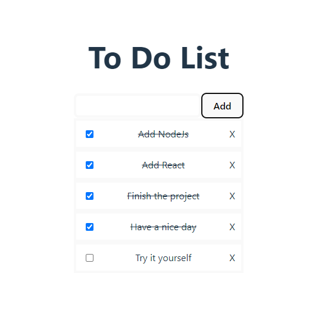

# todo-react
Test project using React & Express

Note: mongo database may not work from another machine cause IP restrictions. You need to change connection string to another DB here: [index.js:9](https://github.com/tltneon/todo-react/blob/main/back/index.js#L9)

## First start the project
1. Navigate to \todo-react\
### Backend
2. Open CMD
3. Type command:
```batch
cd back && npm i && npm start
```
### Frontend
4. Open CMD
5. Type command:
```batch
cd front && npm run auto
```

## Screenshot
